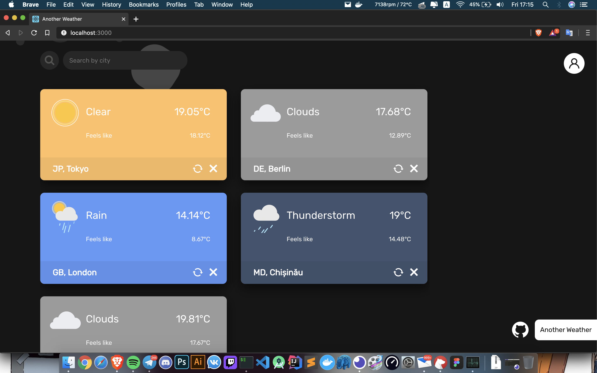

# web-weather

Minimal web weather app



A web based weather application build with ReactJS and Spring Framework

##### Client
  - ReactJS

##### Server
  - Spring Framework (Boot, Webflux, Data, Cloud)

##### Database
  - MongoDB

##### Deploy
  - Docker
  - Docker Compose

#### Functionality:
  - Search for cities
  - Add/Remove citites
  - Synchronize weather
  - Login/Logout/Register
  - Storing cities list on account
  
### Requirements

 - Docker
 - Docker Compose

and that's it -_-
  
#### Start client and server

```bash
docker-compose up
```

#### Start server only

```bash
docker-compose -f docker-compose-backend.yml up
```
